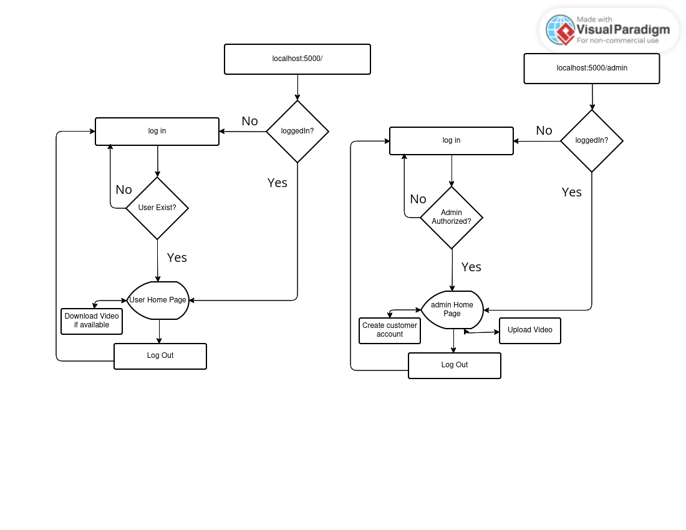

***
# THE CUESTA WEB APP
Bungee jumping service provider companies capture bungee jumping videos of customers, edit them, and provide them to the customers after the video is ready. This process is a bit tedious, inefficient, and time-consuming because it involves multiple manual steps such as contacting customers individually, managing video files, and ensuring each customer receives the correct video. To streamline and automate this process, we present you with **The Cuesta WebApp**. This app allows the company owner to create new customer accounts and upload the customers' bungee jumping videos to the platform. Later, the customers can log in to the app, access their bungee jumping videos, and download them as well. One customer cannot access the video of another customer. 
## The process flow diagram of The Cuesta Web App.

***
# Run **The Cuesta Web APP**
### Clone the project
* `git clone`

### Running the app from docker container
###  Load docker image into your local docker repository
#### `sudo docker load -i DockerImg/CuestaWebAppDockerImage.tar.gz`
### See available images
### Run docker image
#### `sudo docker run --rm -p 5000:5000 thecuestawebapp`
### Run Webapp in your browser
### load `http://127.0.0.1:5000/` in the address bar
### This will load a login page for customer
### UserLogin: use `name`=`Dev` and `email`=`dev@gmail.com` to login as user
### Other customers:
* `name`=`menuka` and `email`=`menuka@gmail.com`
* `name`=`manu` and `email`=`manu@gmail.com`
* `name`=`praks` and `email`=`praks@gmail.com`
* `name`=`sanim` and `email`=`sanim@gmail.com`
* `name`=`logpoint` and `email`=`logpoint@gmail.com`
### Video uploaded by admin for a user will be available at user home to download(see users `dev` and `logpoint`)
### Admin Login:use `username`=`devpro13` and `password`=`1234@1234` to login as Admin
### Admin can now create new account for customer and upload video of the customer
###  Running in local directory
### React project already builded so no need to build again. If you want to build it again, goto `myapp` folder and run the command `npm install && npm run build`.
### For Flask Backend
### Create VirtualENV:
* `virtualenv .VENV`
* `source .VENV/bin/activate`
* `pip install --no-cache-dir -r requirements.txt`
### go to Backend folder and run `python application.py`
### load `http://127.0.0.1:5000/` in the address bar

# Testing
### Go to `Test` folder
### Run `python test.py`, It will run 5 test cases.